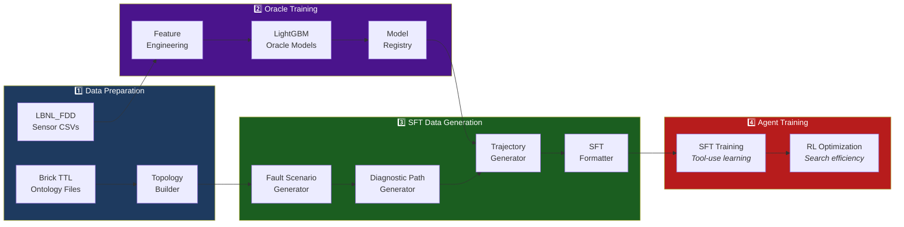

# DiagAgent Documentation

## Architecture & Topology

- [**System Topology Diagrams**](topology_diagrams.md) — Visual maps of all 8 HVAC subsystems and cross-system connections
- [**Diagnostic Flow Examples**](diagnostic_flow_examples.md) — Step-by-step visualization of real SFT diagnostic trajectories

## Pipeline Overview

## Key Design Decisions

| Decision | Choice | Rationale |
|:---|:---|:---|
| Oracle Architecture | LightGBM | Superior on tabular HVAC data vs neural networks |
| Path Routing | Diagnostic Path + Path-Aware Oracle | Ensures logical Normal → Abnormal → Fault progression |
| Sensor Data | Real CSV readings | Agent learns authentic sensor patterns, not synthesized |
| Complexity Control | 3-15 tool calls per trajectory | Easy/Normal/Hard tiers for curriculum learning |
| Cross-System Links | 10 links across 3 media types | Enables multi-hop fault tracing through water/air/thermal |
