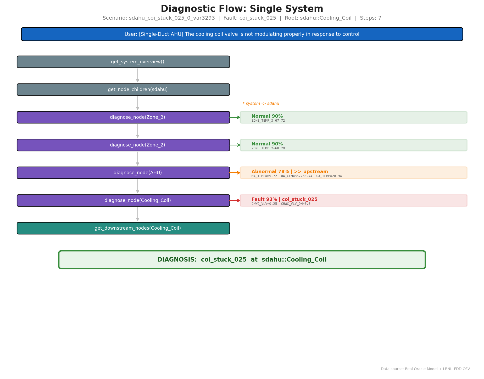
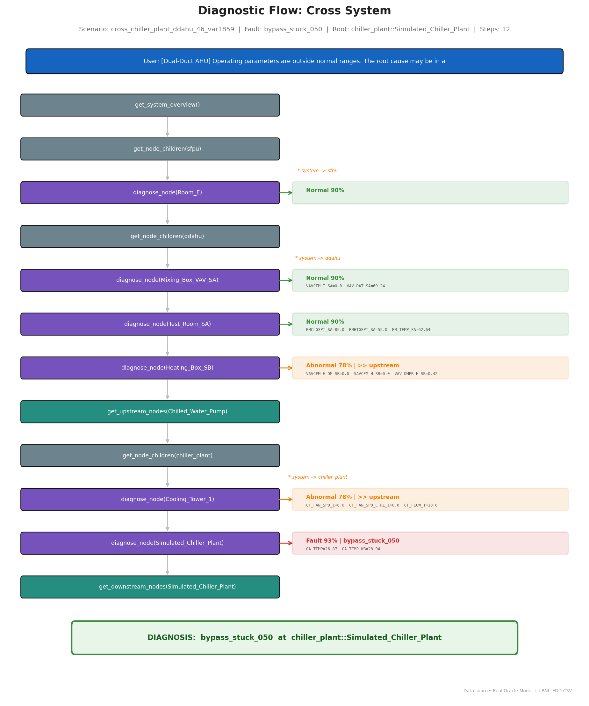
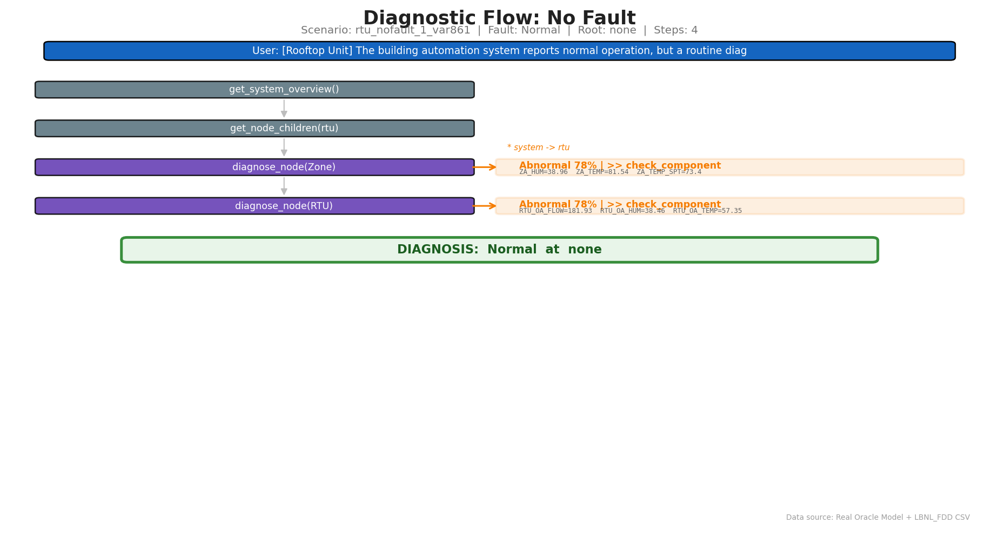

# SFT Diagnostic Flow Visualization

> This document illustrates how the Path-Guided Diagnostic Agent investigates faults
> through multi-step reasoning, using real Oracle model predictions and actual LBNL_FDD sensor data.
> All diagrams are generated from real SFT training samples in `outputs/data/sft_train.jsonl`.

---

## 1. Single-System Fault: Cooling Coil Stuck

**Scenario**: SDAHU cooling coil valve stuck at 25% position.
Agent traces from zones → AHU → Cooling Coil following `suggested_direction: upstream`.

### Key Observations

- **Elimination steps**: Zone_3 (Normal, 90%) and Zone_2 (Normal, 90%) are ruled out first
- **Abnormal signal**: AHU detected abnormal with real sensor readings: `MA_TEMP=69.72`, `OA_CFM=357730.44`
- **Fault located**: Cooling_Coil confirmed as fault source with `CHWC_VLV=0.25`, `CHWC_VLV_DM=0.0`
- **Path routing**: `suggested_direction: upstream` guided the agent from AHU to Cooling_Coil

---

## 2. Cross-System Fault: Chiller Plant Bypass Stuck

**Scenario**: A `bypass_stuck_050` fault at `chiller_plant::Simulated_Chiller_Plant` propagates through chilled water lines to the Dual-Duct AHU.
Agent traverses SFPU → DDAHU → Chiller Plant (3 systems, 12 tool calls).

### Key Observations

- **Multi-hop reasoning**: Agent traverses 3 systems: SFPU → DDAHU → Chiller Plant
- **Cross-system tracing**: `get_upstream_nodes(Chilled_Water_Pump)` discovers the chiller plant link
- **Real sensor readings**: 
  - DDAHU: `VAVCFM_H_DM_SB=0.0`, `VAV_DMPR_H_SB=0.42` (abnormal damper/flow)
  - Chiller: `CT_FAN_SPD_1=0.0`, `CT_FLOW_1=18.6` (cooling tower operating anomaly)
  - Root cause: `OA_TEMP=26.87°F`, `OA_TEMP_WB=28.94°F` (confirmed at plant level)
- **12 tool calls**: Systematic elimination before root cause identification

---

## 3. No-Fault Scenario

**Scenario**: Routine SDAHU health check — all components operating normally.

### Key Observations

- **Short trajectory**: Only 4 tool calls needed to confirm no fault
- **Consistent Normal status**: All diagnosed nodes return Normal with 90% confidence
- **Teaches agent restraint**: Important for preventing false-positive fault reporting

---

## 4. Status Legend

| Status | Color | Agent Action |
|:---|:---|:---|
| **Normal** (green) | Component healthy | Eliminate, try other nodes |
| **Abnormal** (orange) | Symptoms present | Follow `suggested_direction` |
| **Fault** (red) | Root cause found | Record fault type, verify downstream |

## 5. Data Fidelity

All sensor readings in the diagnostic flow diagrams are **real values** from LBNL_FDD CSV data files:

| Example | Sensor | Value | Source |
|:---|:---|:---|:---|
| Single-System | `CHWC_VLV` | 0.25 | SDAHU cooling coil valve position |
| Single-System | `MA_TEMP` | 69.72°F | SDAHU mixed air temperature |
| Cross-System | `CT_FAN_SPD_1` | 0.0 | Chiller cooling tower fan speed |
| Cross-System | `VAV_DMPR_H_SB` | 0.42 | DDAHU VAV damper position |

---

> **Regeneration**: Run `python scripts/generate_docs_images.py` to regenerate all diagrams from the current SFT data.
