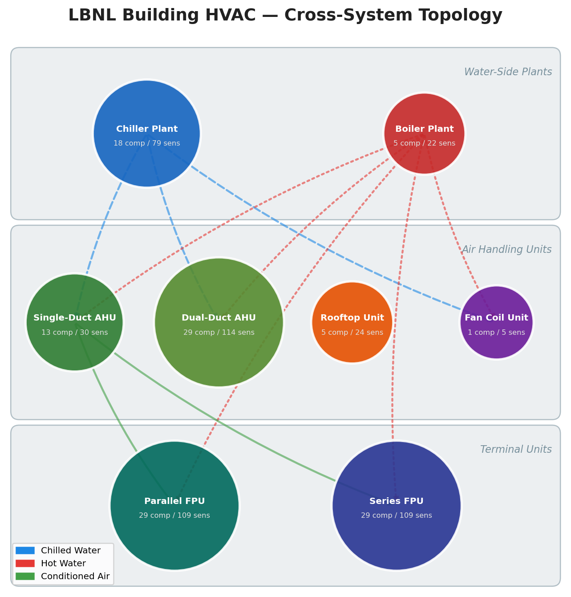
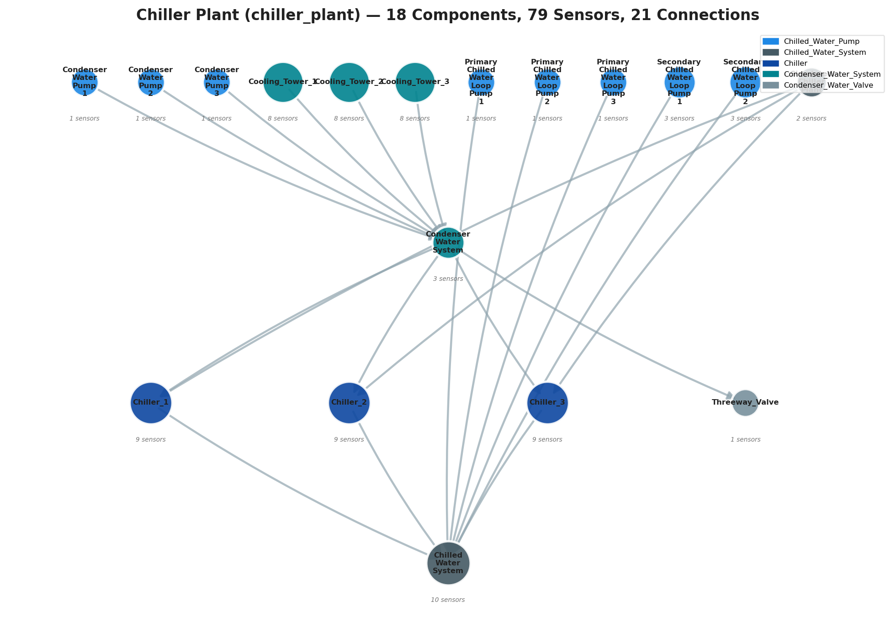
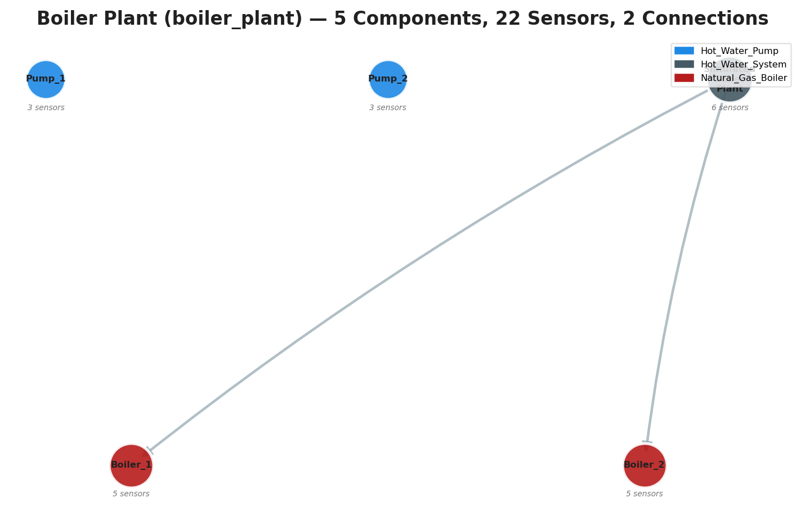
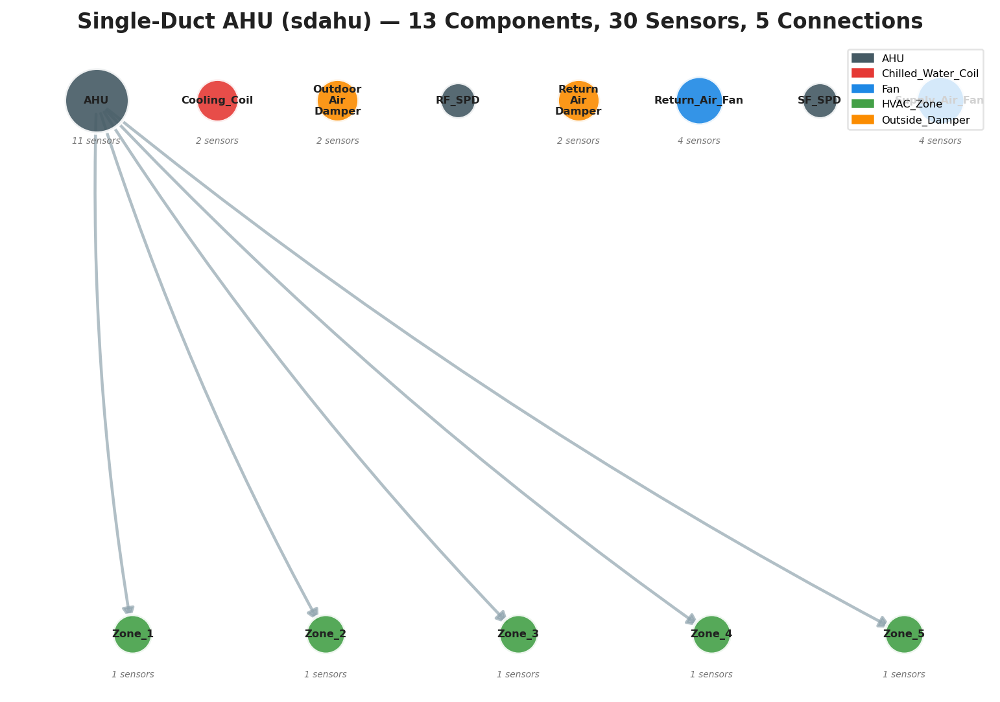
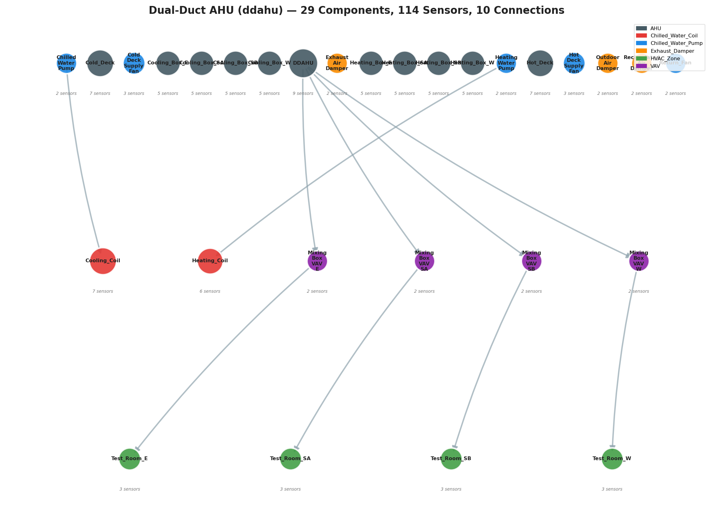
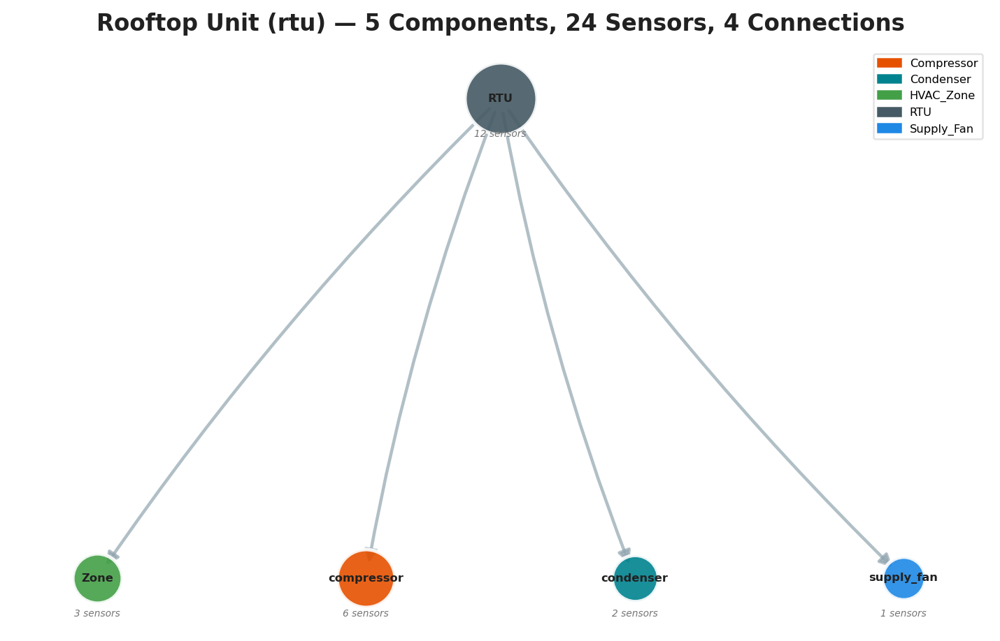
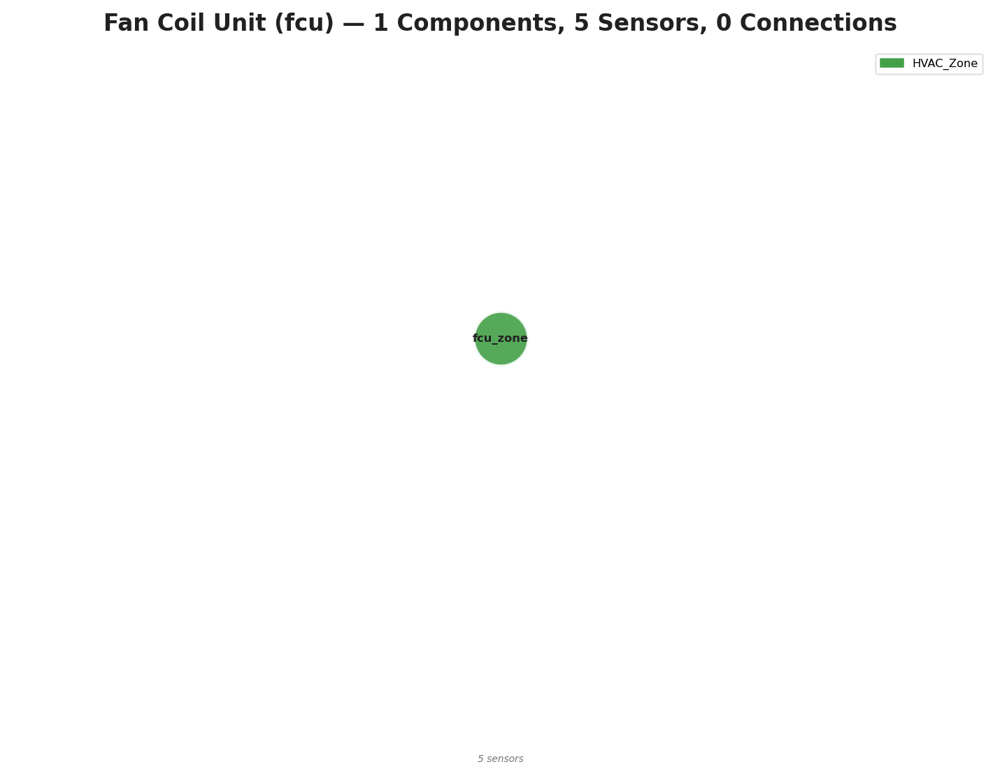
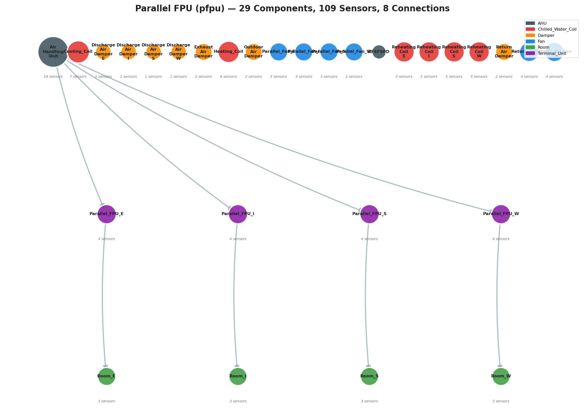
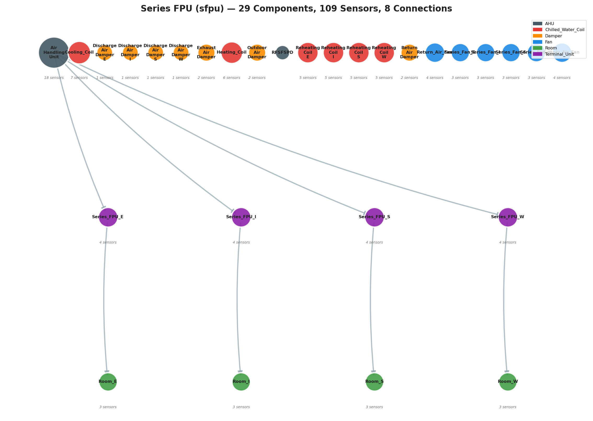

# LBNL_FDD HVAC System Topology

> This document visualizes the multi-tier building HVAC topology used by the Path-Guided Diagnostic Agent.
> The topology follows a **Building → System → Component → Sensor** hierarchy.
> All diagrams are generated from the actual `TopologyBuilder` code in [`topology_builder.py`](../src/topology/topology_builder.py).

---

## 1. Cross-System Overview

The building contains 8 HVAC systems connected by chilled water, hot water, and conditioned air loops.

### Cross-System Fault Propagation Paths

| Source System | Source Node | Target System | Target Node | Medium |
|:---|:---|:---|:---|:---|
| Chiller Plant | Chilled_Water_System | SDAHU | Cooling_Coil | chilled_water |
| Chiller Plant | Chilled_Water_System | DDAHU | Cooling_Coil | chilled_water |
| Chiller Plant | Chilled_Water_System | FCU | fcu_zone | chilled_water |
| Boiler Plant | Simulated_Boiler_Plant | SDAHU | AHU | hot_water |
| Boiler Plant | Simulated_Boiler_Plant | DDAHU | Heating_Coil | hot_water |
| Boiler Plant | Simulated_Boiler_Plant | FCU | fcu_zone | hot_water |
| Boiler Plant | Simulated_Boiler_Plant | PFPU | Heating_Coil | hot_water |
| Boiler Plant | Simulated_Boiler_Plant | SFPU | Heating_Coil | hot_water |
| SDAHU | AHU | PFPU | Parallel_FPU_E | conditioned_air |
| SDAHU | AHU | SFPU | Series_FPU_E | conditioned_air |

---

## 2. Chiller Plant (chiller_plant)

Central chiller plant with 3 chillers, cooling towers, and pumps providing chilled water.

---

## 3. Boiler Plant (boiler_plant)

Hot water boiler plant with 2 boilers and pumps providing heating water.

---

## 4. Single-Duct AHU (sdahu)

Single-duct variable air volume AHU serving 5 zones via VAV boxes.

---

## 5. Dual-Duct AHU (ddahu)

Dual-duct AHU with hot and cold decks serving 4 mixing box VAV zones.

---

## 6. Rooftop Unit (rtu)

Packaged rooftop unit with DX cooling, compressors, condenser, and supply fan.

---

## 7. Fan Coil Unit (fcu)

Fan coil unit with cooling/heating coils and fan.

---

## 8. Parallel Fan Powered Unit (pfpu)

Parallel fan powered VAV terminal unit with reheat, serving 4 zones (E/I/S/W).

---

## 9. Series Fan Powered Unit (sfpu)

Series fan powered VAV terminal unit with reheat, serving 4 zones (E/I/S/W).

---

## 10. Topology Statistics

| System | Components | Sensors | Type | Cross-System Links |
|:---|:---:|:---:|:---|:---|
| Chiller Plant | 18 | 79 | Water | → SDAHU, DDAHU, FCU |
| Boiler Plant | 5 | 22 | Water | → SDAHU, DDAHU, FCU, PFPU, SFPU |
| SDAHU | 13 | 30 | Air | ← CP, BP → PFPU, SFPU |
| DDAHU | 29 | 114 | Air | ← CP, BP |
| RTU | 5 | 24 | Air | (standalone) |
| FCU | 1 | 5 | Air | ← CP, BP |
| PFPU | 29 | 109 | Terminal | ← BP, SDAHU |
| SFPU | 29 | 109 | Terminal | ← BP, SDAHU |
| **Total** | **129** | **492** | | **10 links** |

---

> **Regeneration**: Run `python scripts/generate_docs_images.py` to regenerate all diagrams from the current topology code.
